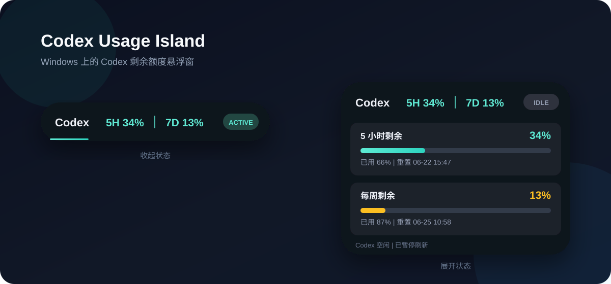

# Codex Usage Island

[English](README.en.md)

<p align="center">
  
</p>

## 安装

### 使用 Codex 安装（推荐）

直接把下面这段话发送给 Codex：

```text
请在这台 Windows 电脑上安装 https://github.com/da-zheng-ge/codex-usage-island 的 v1.0.0。下载 v1.0.0 标签的源码压缩包到临时目录，解压后运行 Install.cmd，最后确认桌面已经创建 Codex Usage Island 快捷方式。不要安装或替换 Codex 本身。
```

Codex 会自动下载、解压、运行安装程序并检查桌面快捷方式。根据权限设置，执行下载或安装前可能需要你确认。

更多细节参见 [使用 Codex 安装](INSTALL_WITH_CODEX.md)。

### 手动安装

1. 下载 [v1.0.0 源码压缩包](https://github.com/da-zheng-ge/codex-usage-island/archive/refs/tags/v1.0.0.zip)。
2. 解压 ZIP。
3. 双击 **Install.cmd**。
4. 安装完成后，双击桌面的 **Codex Usage Island** 快捷方式。

也可以在项目目录运行：

```powershell
powershell -ExecutionPolicy Bypass -File .\install.ps1
```

安装程序会：

1. 将运行文件复制到 `%LOCALAPPDATA%\CodexUsageIsland`。
2. 在桌面创建 **Codex Usage Island** 快捷方式。
3. 启动一次灵动岛。

程序会依次从正在运行的 app-server、Codex Desktop 本地 CLI 目录、VS Code 扩展目录和 `PATH` 中自动查找 Codex。

## 功能

- 显示 5 小时和每周限额的剩余百分比
- 展开后显示额度重置时间
- Codex 工作时显示动态效果
- 仅在 Codex 对话进行中每 15 秒刷新一次用量
- WPF 抗锯齿圆角与平滑动画
- Codex 空闲且最小化时自动隐藏
- 不处理 API Key，也不读取认证文件

## 系统要求

- Windows 10 或 Windows 11
- Windows PowerShell 5.1 或更高版本
- Codex Desktop 或本地安装的 Codex CLI
- 已登录的 Codex 会话

本项目使用本机的 `codex app-server`。该协议跟随 Codex 版本演进，未来版本可能发生变化。

## 使用

- 单击灵动岛展开或收起详情。
- 右键选择“退出”关闭。
- 双击桌面快捷方式重新打开。
- `ACTIVE` 表示 Codex 正在执行任务。
- `IDLE` 表示账号用量轮询已暂停。

## 卸载

双击安装包中的 **Uninstall.cmd**，或者运行：

```powershell
powershell -ExecutionPolicy Bypass -File .\uninstall.ps1
```

卸载程序只会删除包含安装标记的目录，避免误删其他文件。

## 隐私

程序只读取：

- 本地 Codex app-server 返回的限额百分比和重置时间
- 本地会话日志中的 `task_started` 和 `task_complete` 事件类型
- Codex 桌面窗口的显示状态

程序不会提取、保存或传输提示词、回复、访问令牌、API Key 或认证文件，也不包含遥测功能。

## 开发

直接从仓库运行：

```powershell
powershell -NoProfile -STA -ExecutionPolicy Bypass -File .\src\CodexUsageIsland.ps1
```

也可以指定 Codex CLI 路径：

```powershell
.\src\CodexUsageIsland.ps1 -CodexPath 'C:\path\to\codex.exe'
```

嵌入的 C# 代码需要保持与 Windows PowerShell 5.1 自带编译器兼容。

## 许可证

[MIT](LICENSE)
